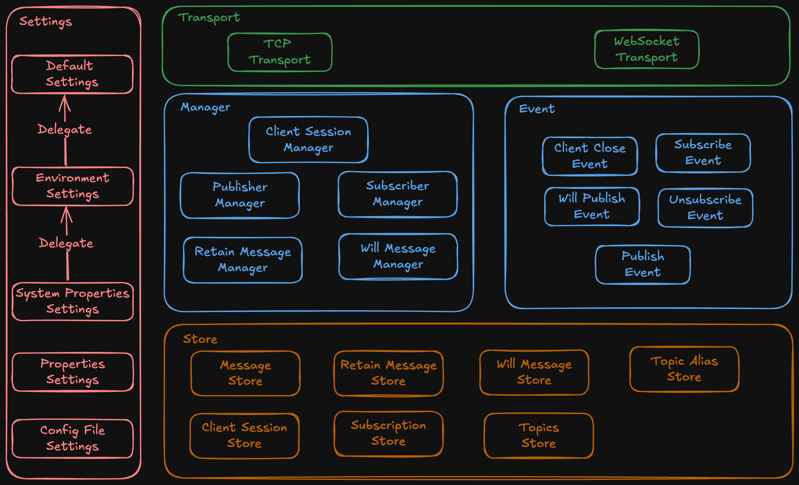

# monaco
An mqtt broker based on vertx

## Architecture

### Layer

#### Transport Layer

Handling network connection and provide `MqttEndpoint` instance.

1. TCP transport
2. WebSocket transport

#### Manager Layer

Main Logic abstractions. Each manager contains multiple event listeners and store.

##### Client Session Manager

Maintain client session data and publish related events. 
Such as client register/unregister, publish session connected/close event